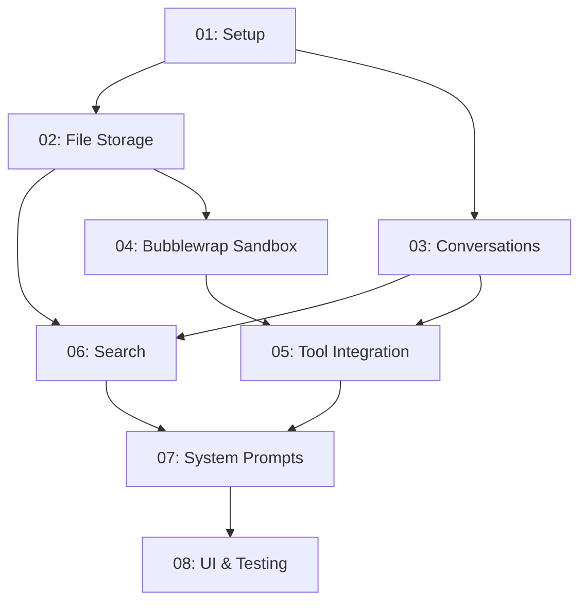

# Implementation Roadmap

## Overview

This roadmap breaks down the implementation into **8 concrete steps**, each scoped to one focused PR.

```
Phase 1: Foundation (Steps 1-3)
├─ 01: Project setup & Postgres schema
├─ 02: Filesystem storage & file APIs
└─ 03: Conversations as markdown files

Phase 2: Execution (Steps 4-5)
├─ 04: Bubblewrap sandbox execution
└─ 05: Tool integration in /api/turn

Phase 3: Search & Polish (Steps 6-9)
├─ 06: Unified search (Postgres FTS + pgvector)
├─ 07: System prompts & context
├─ 08: UI & testing
└─ 09: Conversation context management
```

## Dependency Graph



## Phase 1: Foundation

### Step 01: Project Setup & Postgres Schema
**Goal:** Database schema, migrations, basic project/config management

**Complexity:** Low-Medium (3-4 hours)

**Prerequisites:**
- Postgres installed and running on Fedora host
- pgvector extension installed (`dnf install pgvector`)
- Database created: `createdb multimodelchat`

**Deliverables:**
- Postgres database with schema (projects, files metadata, conversations metadata, config)
- pgvector extension enabled for future embedding storage
- Migration system
- Basic CRUD for projects and config
- Test script verifying schema

**Files:**
- `server/db/schema.sql`
- `server/db/__init__.py` (using `asyncpg` package)
- `server/db/migrations.py`
- `server/tests/test_schema.py`

**Success Criteria:**
- [ ] Database created with all tables
- [ ] pgvector extension enabled
- [ ] Can create/read/update projects
- [ ] Can store/retrieve config
- [ ] Test script passes

---

### Step 02: Filesystem Storage & File APIs
**Goal:** Store files on filesystem, track metadata in DB, basic file upload/read

**Complexity:** Medium (3-4 hours)

**Dependencies:** Step 01

**Deliverables:**
- Project directory creation (`projects/{project-id}/files/`)
- File upload API (writes to filesystem + DB metadata)
- File read API (reads from filesystem)
- File listing API
- Hash-based change detection

**Files:**
- `server/files/storage.py`
- `server/files/routes.py`
- `server/utils/hash.py`
- `server/tests/test_files.py`

**Endpoints:**
- `POST /api/projects/:id/files` - Upload file
- `GET /api/projects/:id/files/:fileId` - Get file content
- `GET /api/projects/:id/files` - List files
- `DELETE /api/projects/:id/files/:fileId` - Delete file

**Success Criteria:**
- [ ] Can upload file via API
- [ ] File written to `projects/{id}/files/{path}`
- [ ] Metadata stored in `project_files` table
- [ ] Can read file content
- [ ] Can list all files in project
- [ ] Hash verification works

---

### Step 03: Conversations as Markdown Files
**Goal:** Save conversation messages as .md files, track metadata in DB

**Complexity:** Medium (3-4 hours)

**Dependencies:** Step 01

**Deliverables:**
- Conversation creation (creates `.conversations/{conv-id}/` directory)
- Message writer (saves to .md with YAML frontmatter)
- Message reader (parses .md files)
- Conversation listing/retrieval APIs

**Files:**
- `server/conversations/writer.py`
- `server/conversations/reader.py`
- `server/conversations/routes.py`
- `server/tests/test_conversations.py`

**Endpoints:**
- `POST /api/conversations` - Create conversation
- `GET /api/conversations/:id` - Get conversation with messages
- `GET /api/conversations?projectId=X` - List conversations

**Message Format:**
```markdown
---
id: msg-abc123
speaker: agent:gpt-4o
model: gpt-4o
round: 1
timestamp: 2025-01-15T10:30:00Z
usage:
  input_tokens: 1250
  output_tokens: 432
---

Message content here...
```

**Success Criteria:**
- [ ] Can create conversation
- [ ] Can save user message to .md file
- [ ] Can save agent message to .md file
- [ ] Can read conversation with all messages
- [ ] Metadata correctly parsed from frontmatter
- [ ] Can list all conversations for project

---

## Phase 2: Execution

### Step 04: Bubblewrap Sandbox Execution
**Goal:** Execute bash commands in sandboxed bubblewrap processes

**Complexity:** Medium (3-4 hours)

**Dependencies:** Step 02 (needs project directories)

**Deliverables:**
- Bubblewrap command executor (replaces Docker)
- Project directory isolation
- Timeout and resource limits
- Test suite for execution

**Files:**
- `server/execution/sandbox.py`
- `server/tests/test_sandbox.py`

**Bubblewrap Configuration:**
```bash
# Sandbox command structure
bwrap \
  --ro-bind /usr /usr \
  --ro-bind /lib /lib \
  --ro-bind /lib64 /lib64 \
  --bind {projectDir} /workspace \
  --tmpfs /tmp \
  --unshare-all \
  --share-net \
  --die-with-parent \
  --chdir /workspace \
  bash -c "{command}"
```

**Execution API:**
```python
async def execute_bash(command: str, project_id: str, **options) -> ExecutionResult:
    # Returns ExecutionResult(stdout, stderr, exit_code, success, timed_out)
```

**Success Criteria:**
- [ ] Bubblewrap installed and working on Linux host
- [ ] Can execute simple bash commands
- [ ] Project directory correctly mounted as /workspace
- [ ] Can create files in project directory
- [ ] Can run Python scripts (using system Python or project-local)
- [ ] Can run Node.js scripts
- [ ] Timeout protection works
- [ ] Can create .venv and install packages
- [ ] Can install project-local pyenv/nvm

**Example Commands:**
```bash
# Create Python venv (using system Python, latest stable)
python3 -m venv .venv

# Install packages
source .venv/bin/activate && pip install pandas

# Run script
source .venv/bin/activate && python analyze.py

# Install project-local pyenv for specific Python versions
curl https://pyenv.run | PYENV_ROOT=$PWD/.pyenv bash

# Use project-local Python
export PYENV_ROOT=$PWD/.pyenv && .pyenv/bin/pyenv install 3.12

# npm (using system Node.js, latest stable LTS)
npm install lodash
node script.js
```

**Note:** System Python and Node.js should be latest stable versions. Models can install project-local versions via pyenv/nvm when specific versions are needed.

---

### Step 05: Tool Integration in /api/turn
**Goal:** Integrate bash tool into conversation endpoint, enable model code execution

**Complexity:** High (4-6 hours)

**Dependencies:** Steps 03, 04

**Deliverables:**
- Model provider adapters with tool support (OpenAI, Anthropic, Google)
- Bash tool definition
- Tool calling loop in /api/turn
- Basic /api/turn endpoint (without search context yet)

**Files:**
- `server/adapters/openai.py`
- `server/adapters/anthropic.py`
- `server/adapters/google.py`
- `server/execution/tools.py`
- `server/main.py` (FastAPI app)
- `server/tests/test_turn.py`

**Tool Definition:**
```python
BASH_TOOL = ToolDefinition(
    name="bash",
    description="Execute bash commands in project directory",
    parameters={
        "type": "object",
        "properties": {
            "command": {
                "type": "string",
                "description": "Bash command to execute"
            }
        },
        "required": ["command"]
    }
)
```

**Tool Calling Loop:**
```python
# 1. Send message to model with tools
# 2. If model calls bash tool:
#    a. Execute in bubblewrap sandbox
#    b. Return results to model
#    c. Model generates final response
# 3. Save final response to conversation
```

**Success Criteria:**
- [ ] Can send message to single model
- [ ] Model can call bash tool
- [ ] Bash tool executes in bubblewrap sandbox
- [ ] Tool results returned to model
- [ ] Model generates final response
- [ ] Response saved to .conversations/.../rounds/
- [ ] Works with multiple models in parallel
- [ ] Multi-turn tool calling works (model can call bash multiple times)

---

## Phase 3: Search & Polish

### Step 06: Unified Search (Postgres FTS + pgvector)
**Goal:** Index files and conversations, enable search across both

**Complexity:** Medium (3-4 hours)

**Dependencies:** Steps 02, 03

**Deliverables:**
- Chunking logic (split files into searchable chunks)
- Indexer (files → chunks → Postgres FTS)
- Conversation indexer
- Search API (keyword + future semantic)
- Auto-indexing via inotify file watching (indexer daemon)

**Files:**
- `server/indexing/chunker.py`
- `server/indexing/embedder.py`
- `server/indexing/indexer.py`
- `server/indexing/search.py`
- `server/tests/test_search.py`
- `indexer/main.py`
- `indexer/watcher.py`

**Indexing Pipeline:**
```
1. File change detected (inotify via watchdog)
2. Read content from filesystem
3. Split into chunks (~50 lines or ~500 tokens)
4. Insert into content_chunks table with tsvector
5. Generate embeddings with Qwen3-Embedding-0.6B
6. Store embeddings in pgvector
```

**Search API:**
```python
POST /api/projects/:id/search
{
  "query": "authentication flow",
  "limit": 10,
  "mode": "hybrid"  # fts, semantic, or hybrid
}

# Returns ranked results from files AND conversations
```

**Success Criteria:**
- [ ] Can index a file
- [ ] Can index a conversation message
- [ ] Can search and get results from files
- [ ] Can search and get results from conversations
- [ ] Results ranked by relevance
- [ ] Auto-indexing on file upload works
- [ ] Auto-indexing on message creation works
- [ ] Can filter by file type

---

### Step 07: System Prompts & Context
**Goal:** Build rich system prompts with project context, file listings, search results

**Complexity:** Low (2-3 hours)

**Dependencies:** Steps 05, 06

**Deliverables:**
- System prompt builder
- Project context assembly (file list, conversation info)
- Instructions for bash tool usage
- Instructions for creating environments

**Files:**
- `server/prompts/builder.py`
- `server/prompts/templates.py`

**System Prompt Structure:**
```
You are {modelId} in a multi-model conversation.

PROJECT CONTEXT:
Working in "{projectName}" project.

BASH EXECUTION:
You have access to bash in a sandboxed environment.
Working directory: /workspace/
Create environments: python3 -m venv .venv
Install packages: source .venv/bin/activate && pip install pandas
For specific Python versions: install pyenv to .pyenv/ then pyenv install <version>

PROJECT FILES ({count} total):
- workspace/data/sales.csv (1.2KB)
- workspace/scripts/analyze.py (450B)
- workspace/README.md (2.1KB)

CONVERSATION:
This is round {roundNumber} of the conversation.
{summary if available}

[Provider-specific instructions]
```

**Success Criteria:**
- [ ] System prompt includes project name
- [ ] System prompt includes file listing
- [ ] System prompt includes bash instructions
- [ ] System prompt includes conversation context
- [ ] Different prompts for different providers (OpenAI vs Anthropic)

---

### Step 08: UI & Testing
**Goal:** Basic web UI, end-to-end testing, documentation

**Complexity:** Medium (3-4 hours)

**Dependencies:** Step 07

**Deliverables:**
- Web UI for sending messages and viewing responses
- Project/conversation selector
- File upload interface
- Search interface
- End-to-end test suite
- User documentation

**Files:**
- `web/index.html`
- `web/app.js`
- `web/styles.css`
- `server/tests/test_e2e.py`
- `QUICKSTART.md`

**UI Features:**
- Select project
- Select models to query
- Send message
- View responses from each model
- Upload files
- Search files/conversations
- View conversation history

**E2E Test:**
```python
# Using pytest with httpx async client:
# 1. Create project
# 2. Upload data file
# 3. Send message: "Analyze the data"
# 4. Verify model called bash tool
# 5. Verify results displayed
# 6. Search for "analyze"
# 7. Verify search finds both file and conversation
```

**Success Criteria:**
- [ ] Can select project in UI
- [ ] Can select target models
- [ ] Can send message and see responses
- [ ] Can upload files via UI
- [ ] Can search via UI
- [ ] Can view conversation history
- [ ] E2E test passes
- [ ] Documentation complete

---

### Step 09: Conversation Context Management
**Goal:** Implement conversation summarization and pruning to handle conversations exceeding context windows

**Complexity:** Medium (3-4 hours)

**Dependencies:** Step 05 (Tool integration), Step 07 (System prompts)

**Deliverables:**
- Context-aware message retrieval (automatic truncation)
- Conversation summarization using models
- Summary storage in conversation metadata
- Token counting and threshold detection
- API endpoints for manual summarization
- Integration with prompt builder

**Files:**
- `server/conversations/context.py`
- `server/conversations/summarizer.py`
- `server/tests/test_context.py`
- Updated `server/prompts/builder.py`

**Success Criteria:**
- [ ] Can estimate conversation token count
- [ ] Can detect when summarization is needed
- [ ] Can create summaries using models
- [ ] Summaries stored in conversation settings
- [ ] Prompt builder includes summaries
- [ ] Truncation notices added to system prompt
- [ ] Test script passes

---

## Implementation Strategy

### Parallelization Opportunities

**Steps 02 and 03 can be done in parallel** after Step 01:
- 02 (File Storage) is independent of 03 (Conversations)
- Both depend only on 01 (Database Schema)

**Step 06 can start after 02 or 03 completes:**
- Doesn't need both to be done
- Can test with just files or just conversations first

### Testing Approach

Each step includes:
1. **Unit tests** - Test individual functions
2. **Integration tests** - Test API endpoints
3. **Manual smoke test** - Test via curl or test script

### Migration from Current Codebase

The current implementation has Phase 1a and 1b complete but with different architecture:
- **Reuse:** Basic route structure, adapter patterns
- **Replace:** Database (SQLite → Postgres), execution (Pyodide → Bubblewrap), file storage (DB → filesystem)
- **New:** Conversations as files, unified search with pgvector, indexer daemon, inotify file watching

**Migration Strategy:**
1. Set up new Linux server (Fedora recommended) with Postgres + pgvector
2. Implement new system in parallel (don't modify existing code)
3. Write migration script to move existing conversations to new format
4. Cut over when new system reaches feature parity
5. Archive old code

**Infrastructure Requirements:**
- Linux server (Fedora 43+ recommended)
- Postgres 17+ with pgvector extension
- Bubblewrap (usually available in distro repos: `dnf install bubblewrap`)
- Python 3.12+ with uvicorn for the FastAPI server
- Node.js (latest stable LTS) for model sandbox execution
- sentence-transformers for Qwen3-Embedding-0.6B embeddings

---

## Current Status

🚧 **Not Started** - Ready to begin with Step 01

## Estimated Timeline

- **Phase 1 (Foundation):** 8-11 hours (Steps 01-03)
- **Phase 2 (Execution):** 7-10 hours (Steps 04-05)
- **Phase 3 (Search & Polish):** 11-15 hours (Steps 06-09)

**Total: ~26-36 hours** for complete implementation (including context management)

**Core functionality (Steps 01-08): ~23-32 hours**

Working in focused 3-4 hour sessions, this is **7-12 sessions** to completion.

---

**Previous:** [ARCHITECTURE.md](ARCHITECTURE.md) | **Next:** [specs/](specs/) for detailed implementation guides
